# Instrukcja panelu administratora MotoFun Opole

**Strona:** https://motofan-js.vercel.app
**Wersja dokumentu:** 1.0 · 2026-05-31

> **Zrzuty ekranu** są w katalogu `docs/zrzuty/` — wygenerowane automatycznie
> z produkcji przez `scripts/screenshots.mjs` (Playwright).

---

## Spis treści

1. [Jak się zalogować](#1-jak-się-zalogować)
2. [Panel admina — pasek na dole](#2-panel-admina--pasek-na-dole)
3. [Edycja tekstów (Editable)](#3-edycja-tekstów-editable)
4. [Edycja zdjęć](#4-edycja-zdjęć)
5. [Strona po stronie — co edytować](#5-strona-po-stronie--co-edytować)
6. [Przywracanie i cofanie zmian](#6-przywracanie-i-cofanie-zmian)
7. [Zmiana loginu/hasła](#7-zmiana-loginuhasła)
8. [Wylogowanie](#8-wylogowanie)
9. [Najczęstsze problemy (FAQ)](#9-najczęstsze-problemy-faq)
10. [Bezpieczeństwo — jak są chronione dane logowania](#10-bezpieczeństwo--jak-są-chronione-dane-logowania)

---

## 1. Jak się zalogować

Masz **2 sposoby**, żeby otworzyć logowanie admina:

### A) Bezpośrednio
Wejdź na: **https://motofan-js.vercel.app/login**

### B) Z dowolnej podstrony — dopisz `/login` do adresu
Otwórz dowolną podstronę i dopisz `/login` na końcu URL:
- `https://motofan-js.vercel.app/dla-dzieci/login`
- `https://motofan-js.vercel.app/czesci-uzywane/login`
- `https://motofan-js.vercel.app/motocykle-uzywane/login`
- itd.

Strona przekieruje Cię do logowania, a **po pomyślnym zalogowaniu wróci na tę samą podstronę i automatycznie włączy tryb edycji**.

### Formularz logowania

```
┌────────────────────────────────────┐
│         MOTO FAN                   │
│      Panel administracyjny         │
│                                    │
│  Nazwa użytkownika                 │
│  ┌──────────────────────────────┐  │
│  │ admin                        │  │
│  └──────────────────────────────┘  │
│                                    │
│  Hasło                             │
│  ┌──────────────────────────────┐  │
│  │ ••••••••••••                 │  │
│  └──────────────────────────────┘  │
│                                    │
│  ┌──────────────────────────────┐  │
│  │       Zaloguj się            │  │
│  └──────────────────────────────┘  │
└────────────────────────────────────┘
```

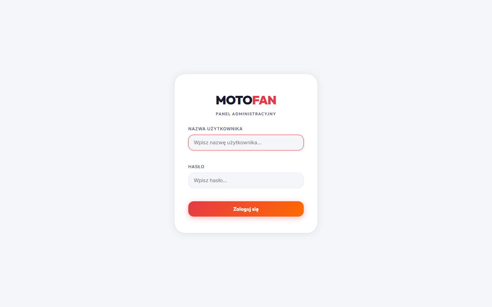

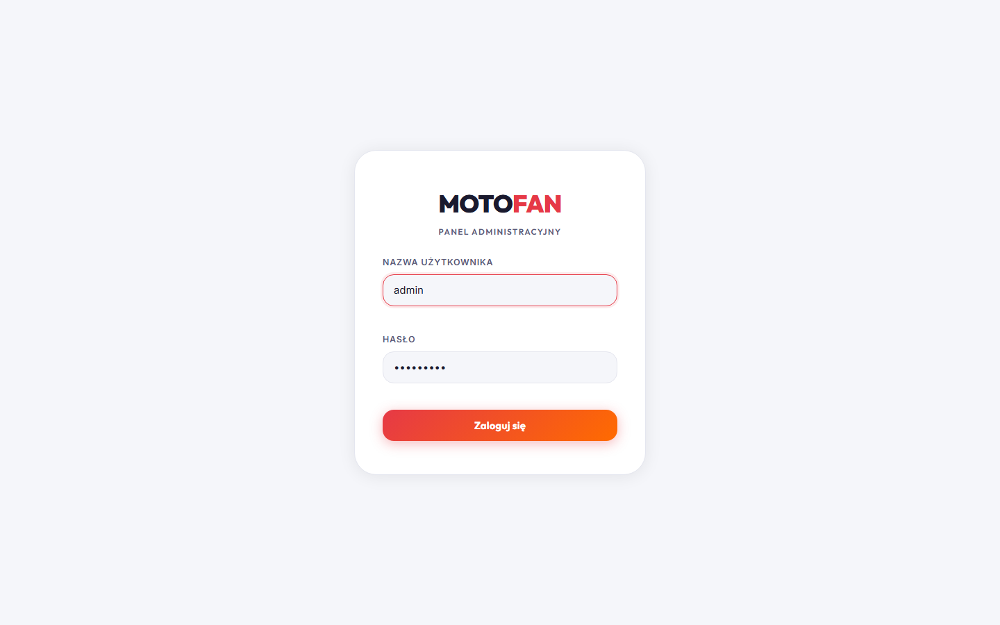

**Domyślne dane (fabryczne, jeśli nie były zmieniane):**
- Login: `admin`
- Hasło: ustawione w zmiennych Vercela jako `ADMIN_PASSWORD`

⚠ **Po 5 nieudanych próbach logowania w 15 minut konto z danego IP zostaje
zablokowane na 15 minut** (ochrona przed brute-force).

---

## 2. Panel admina — pasek na dole

Po zalogowaniu na każdej podstronie pojawi się **ciemny pasek na dole ekranu**:

```
┌──────────────────────────────────────────────────────────────────────────────┐
│ [ADMIN] [Tryb edycji ●]              [Zapisz][Odrzuć] [↻Przywracanie ▾] [🔑Konto] [Wyloguj] │
└──────────────────────────────────────────────────────────────────────────────┘
```

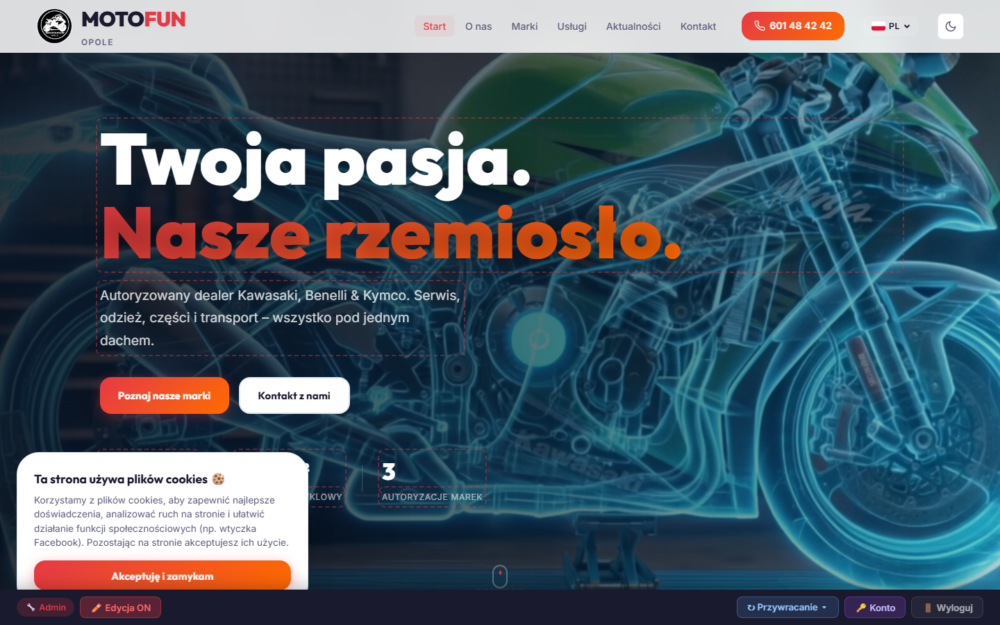

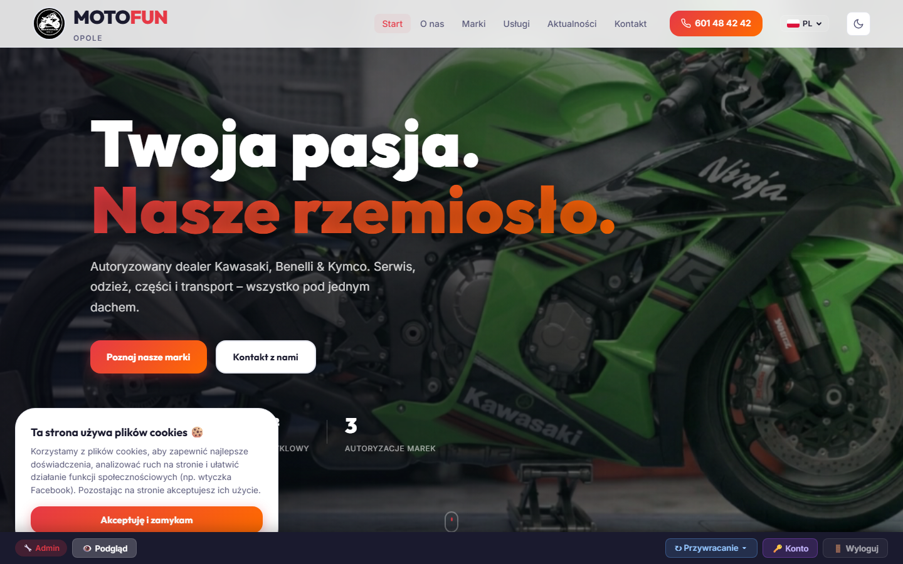

### Opis przycisków (od lewej):

| Element | Co robi |
|---|---|
| **[ADMIN]** | Plakietka informacyjna — pokazuje, że jesteś zalogowany jako admin |
| **Tryb edycji / Podgląd** | Przełącza tryb. W „Trybie edycji" wszystkie edytowalne elementy świecą się czerwoną kropkowaną obwódką |
| **Zapisz** *(widoczny tylko gdy masz niezapisane zmiany)* | Zapisuje wszystkie zmiany w treści do bazy. Bez tego zmiany **NIE są trwałe** |
| **Odrzuć** *(widoczny gdy masz niezapisane zmiany)* | Odrzuca niezapisane zmiany i przywraca ostatnio zapisaną wersję |
| **↻ Przywracanie ▾** | Otwiera menu z 3 opcjami cofania (patrz [pkt 6](#6-przywracanie-i-cofanie-zmian)) |
| **🔑 Konto** | Otwiera formularz zmiany loginu/hasła (patrz [pkt 7](#7-zmiana-loginuhasła)) |
| **Wyloguj** | Kończy sesję |

> 💡 Toolbar jest „przylepiony" do dołu ekranu na każdej podstronie tak długo,
> jak jesteś zalogowany. Niezalogowani goście NIE widzą go w ogóle.

---

## 3. Edycja tekstów (Editable)

### Włącz tryb edycji

W toolbarze kliknij przycisk **„Podgląd"** (zmieni się na **„Tryb edycji"** — kolor czerwony):

```
[ADMIN]  [● Tryb edycji]   ←  klikasz tu
```

### Co zobaczysz

Wszystkie edytowalne teksty na stronie dostaną **kropkowaną czerwoną obwódkę**:

```
┌─ ─ ─ ─ ─ ─ ─ ─ ─ ─ ─ ─ ─ ─ ─ ─ ─ ─ ─┐
│ Strefa Małego Motocyklisty! 🏍️       │   ← edytowalny tytuł hero
└─ ─ ─ ─ ─ ─ ─ ─ ─ ─ ─ ─ ─ ─ ─ ─ ─ ─ ─┘
```

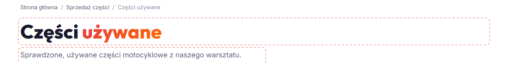

### Jak edytować

1. **Kliknij** w pole z czerwoną obwódką — kursor pojawi się w tekście.
2. **Pisz/usuwaj** — jak w zwykłym edytorze tekstu.
3. **Kliknij poza polem** lub naciśnij **Tab/Enter** (dla pojedynczej linii) — zmiana
   trafia do lokalnej pamięci.
4. **Wciśnij „Zapisz"** w toolbarze, żeby zapisać na serwerze (inaczej zmiany
   przepadną po odświeżeniu strony).

> 💡 Możesz robić **wiele zmian naraz** i kliknąć „Zapisz" jeden raz na końcu.
> Albo „Odrzuć", jeśli się rozmyśliłeś.

### Wskazówki

- **Pole z `multiline`** (np. opisy, akapity) przyjmuje wiele linii i Enter robi
  nową linijkę.
- **Pole bez `multiline`** (np. tytuły, nazwy, etykiety) zamyka się po Enter.
- Niektóre nagłówki mają wbudowane **HTML** (np. `<span class="gradient-text">`)
  — jeśli edytujesz taki tekst, system zachowuje formatowanie. Bądź ostrożny żeby
  nie zepsuć tagów (najlepiej zaznaczyć tylko sam tekst do zmiany).

---

## 4. Edycja zdjęć

Zdjęcia produktów, motocykli RXF, RXF-itp. mają **specjalne nakładki**:

```
┌─────────────────────┐
│                     │
│       ▓▓▓▓▓         │
│      ▓ZDJ ▓         │   ← najedź myszką
│       ▓▓▓▓▓         │
│                     │
└─────────────────────┘
       ↓ najedź
┌─────────────────────┐
│  ╔═══════════════╗  │
│  ║ Zmień obrazek ║  │   ← kliknij, otworzy się okno wyboru pliku
│  ╚═══════════════╝  │
└─────────────────────┘
```

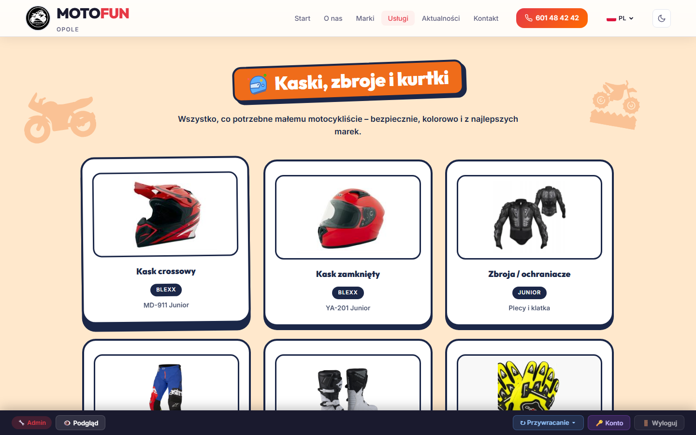

### Krok po kroku

1. Włącz **Tryb edycji** w toolbarze.
2. Najedź myszką na zdjęcie (kafelek produktu, RXF, część itp.) — pojawi się
   czarna nakładka z napisem **„Zmień obrazek"**.
3. Kliknij ją — otworzy się okno wyboru pliku z dysku.
4. Wybierz nowy plik (`.jpg`, `.png`, `.webp` — max ~10 MB).
5. Plik zostanie wgrany na serwer i **od razu podstawiony**. Nie musisz klikać
   „Zapisz" oddzielnie dla zdjęć — upload jest natychmiastowy.

> 💡 **Wskazówka jakości:** najlepsze rezultaty dają zdjęcia produktów na białym
> tle, w proporcji ~4:3 lub kwadratowe, w rozdzielczości 600×600 do 1200×900.

---

## 5. Strona po stronie — co edytować

### 🏠 Strona główna ( `/` )

**Sekcje edytowalne:**
- Hero (tytuł, podtytuł, opis)
- „O nas" — tytuł, opis, treść, zdjęcie
- Marki (Kawasaki / Benelli / Kymco) — opisy i listy punktowane
- „Co oferujemy?" — kafelki usług (tytuł, opis, lista)
- Aktualności (sekcja Facebooka — opis, nie sam feed)
- Kontakt — godziny otwarcia, adres, telefon

**Zakres restore „Przywróć tę podstronę":** klucze `home.*`, `nav.*`, `tag.*`,
`hours.*`, `contact.*`, `footer.home.*`.

---

### 🏍️ Strefa Małego Motocyklisty ( `/dla-dzieci` )

**Sekcje edytowalne:**
- Hero (tytuł „Strefa Małego Motocyklisty!", podtytuł)
- Pasek skrótów (5 etykiet kafelków)
- Sekcje (każda ma nagłówek i opis):
  - Produkty (kaski, zbroje, ubrania)
  - Motocykle RXF
  - Mini-gra
  - Strefa rodzica (4 porady — tytuł + tekst każda)
  - Marki (5 bąbelków — nazwa każdy)
  - CTA z mapą (tytuł, opis, adres)
- **Karty produktów** (6) — nazwa, marka, kategoria, **zdjęcie**
- **Karty RXF** (5) — nazwa, cm³, wiek, **zdjęcie**

**Panel admina mini-gry** (widoczny tylko w trybie edycji, nad kartą quizu):

```
┌──────────────────────────────────────────────────────┐
│ ⚙️ Ustawienia mini-gry                                │
│                                                       │
│  Kod nagrody przy 100%:  [✅ Włączony]                │
│                                                       │
│  Promocja na ekranie wygranej:                        │
│  ┌─────────────────────────────────────────────────┐ │
│  │ 🎁 Pokaż ten kod w salonie i odbierz 10% rabatu!│ │
│  └─────────────────────────────────────────────────┘ │
└──────────────────────────────────────────────────────┘
```

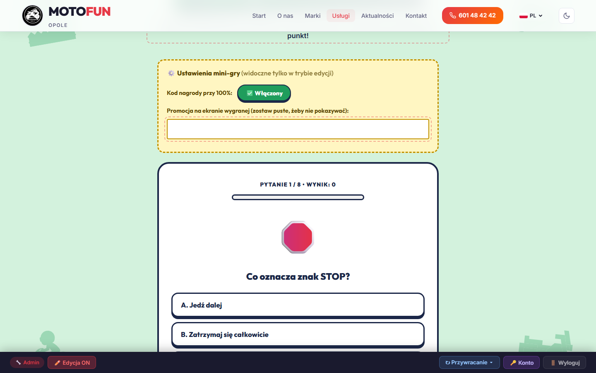

- **Włącz/wyłącz kod** — gdy włączony, gracz po wygranej (100% poprawnych)
  zobaczy losowy kod typu `MOTO-7F3K9Q`. Wyłączony → kod nie powstaje, mail nie
  wychodzi.
- **Promocja** — wpisz tekst (np. „🎁 10% rabatu na kask!"); pokaże się **tylko**
  na ekranie wygranej (przy 100% poprawnych), pod kodem.

> 💡 **Mail z kodem nagrody** wychodzi na `lylyly24@gmail.com` przez Resend, ale
> tylko gdy w Vercel jest ustawiony sekret `RESEND_API_KEY` (patrz README projektu).
> Bez klucza kod się pokazuje graczowi, ale e-mail nie idzie.

**Zakres restore „Przywróć tę podstronę":** klucze `kids.*`.

---

### 🔧 Sprzedaż części ( `/czesci` )

**Sekcje edytowalne:**
- Hero (tytuł, opis)
- Sekcja marek (Kawasaki/Benelli/Kymco)
- Lista kategorii części (silnik, hamulce, zawieszenie, napęd, elektryka itd.)
- „Jak zamówić" — opisy procesu
- Sidebar (telefon, adres)

**Button na sam wierzch:** **„Zobacz nasze części używane →"** — prowadzi do
`/czesci-uzywane`.

**Zakres restore:** `czesci.*`.

---

### 🛠️ Części używane ( `/czesci-uzywane` )

To **dynamiczna lista** zarządzana przez admina:

**Tekst statyczny (edytowalny przez Editable):**
- Hero (tytuł, opis)
- 3 info-karty (sprawdzone w warsztacie / zakup tylko przez telefon / pomoc)
- CTA na dole

**Lista części (CRUD przez panel admina):**

Po wejściu w trybie edycji nad listą pojawi się przycisk **„Zarządzaj częściami"**:

```
[ Zarządzaj częściami ]    ←  ten przycisk
```

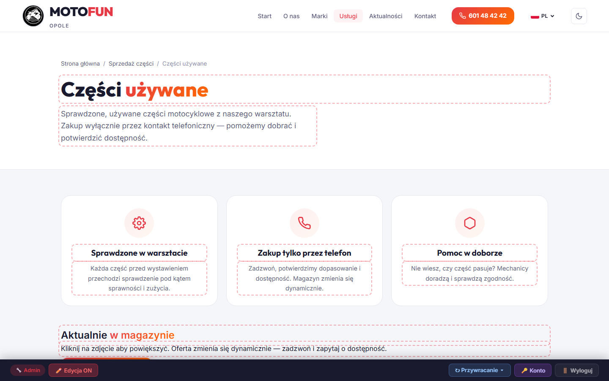

Kliknij — otworzy się modalny panel z listą wszystkich części i przyciskami:

- **➕ Dodaj część** — formularz: nazwa, marka, kategoria, stan, cena, opis,
  pasuje do, dostępność, **zdjęcia** (drag&drop, można dodać wiele).
- **Edytuj** (przy każdej części) — zmień dowolne pole.
- **Usuń** — z potwierdzeniem.

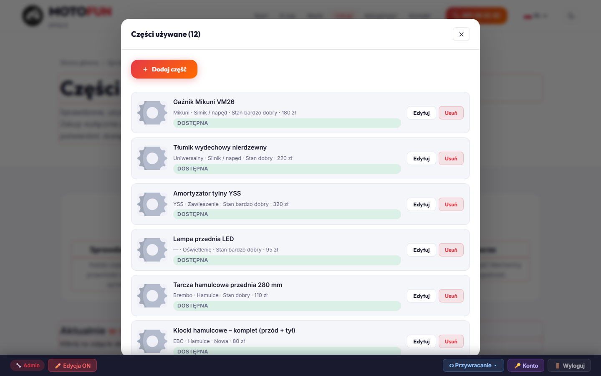

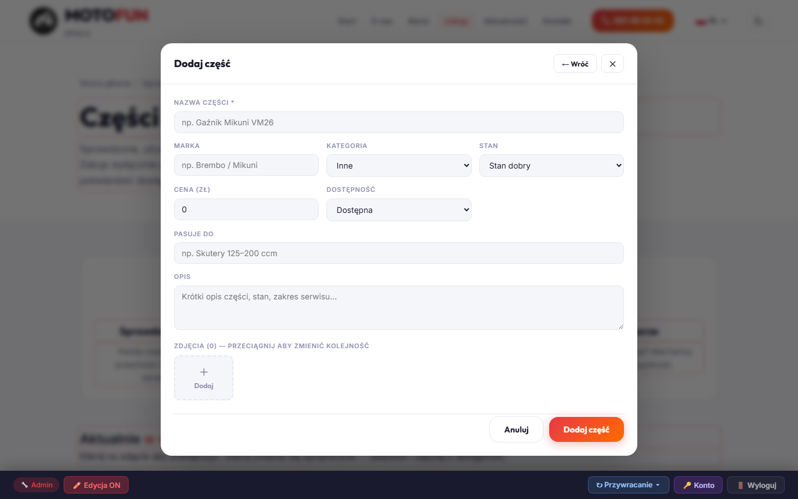

**Zakup tylko przez telefon** — żaden kupujący nie ma jak zamówić online.
Wyświetlany przycisk to **„Zadzwoń: 601 48 42 42"**.

**Zakres restore:** `czesci-uzywane.*` (tekstów); same części są w osobnym
„magazynie" (Vercel Blob `parts.json`) i NIE są resetowane przyciskiem restore —
zarządzaj nimi tylko przez panel „Zarządzaj częściami".

---

### 🏍️ Motocykle używane ( `/motocykle-uzywane` ) / nowe ( `/motocykle-nowe` )

Analogicznie do części używanych:
- Hero + info-karty + CTA — `Editable`.
- Lista motocykli — panel **„Zarządzaj motocyklami"** (CRUD, marka/model/rok/
  przebieg/cena/zdjęcia).

**Zakres restore:** `uzywane.*` / `nowe.*`.

---

### 🔩 Serwis ( `/serwis-motocyklowy` )

- Hero, opisy usług, cennik orientacyjny, sprzęt na którym pracujemy, CTA telefon.
- **Zakres restore:** `serwis.*`.

### 👕 Sklep ( `/sklep` )

- Hero, opisy oferty (odzież, kaski, akcesoria), CTA. **Zakres:** `sklep.*`.

### 🚚 Transport i wynajem ( `/transport-i-wynajem` )

- Dwie sekcje (transport + wynajem przyczepy), opisy, cennik orientacyjny.
  **Zakres:** `transport.*`.

### 📜 Historia ( `/historia` )

- Linia czasu z etapami rozwoju firmy, opisy każdego etapu, zdjęcia historyczne.
  **Zakres:** `historia.*`.

---

## 6. Przywracanie i cofanie zmian

W toolbarze kliknij przycisk **„↻ Przywracanie ▾"** — pojawi się menu trzech opcji:

```
┌──────────────────────────────────────────────────┐
│  ↶ Cofnij ostatnią zmianę                         │
│    na podstronie „Strefa Małego Motocyklisty"     │
│                                                   │
│  ⟳ Przywróć tę podstronę                          │
│    „Strefa Małego Motocyklisty" → stan domyślny   │
│                                                   │
│  ⟲ Przywróć CAŁY serwis           (czerwone)     │
│    wszystkie podstrony → stan domyślny            │
└──────────────────────────────────────────────────┘
```

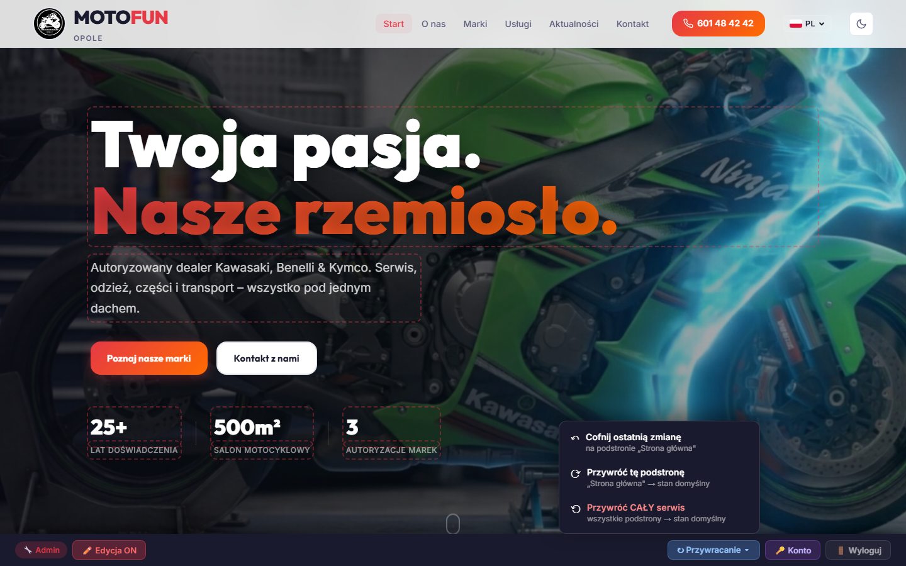

### Co która opcja robi

| Opcja | Co przywraca |
|---|---|
| **↶ Cofnij ostatnią zmianę** | Pop najnowszego zapisu z historii **tylko dla bieżącej podstrony**. Kolejne kliknięcia cofają kolejne zmiany jak Ctrl+Z (limit 30 wstecz) |
| **⟳ Przywróć tę podstronę** | Resetuje WSZYSTKIE edycje **tylko bieżącej podstrony** do stanu domyślnego (czyli takiego jaki był po pierwszym wdrożeniu). Inne podstrony zostają |
| **⟲ Przywróć CAŁY serwis** | Resetuje wszystkie edycje na wszystkich podstronach do stanu domyślnego |

Każda akcja **prosi o potwierdzenie** (alert „OK / Anuluj"), żeby przypadkowo nic
nie zniszczyć. Po potwierdzeniu **strona się przeładuje** żeby pokazać zmiany.

> 💡 **Co to jest „stan domyślny"?**
> To zdjęcie treści zrobione automatycznie przy pierwszym wdrożeniu nowej wersji
> serwisu. Każda Twoja zmiana to **„nakładka"** na ten baseline. Restore zdejmuje
> nakładki.

> 💡 **Cofnięcia są też cofalne.** Każde „Przywróć / Cofnij" też trafia do
> historii, więc jeśli pomyłkowo wyzerowałeś, możesz odzyskać przez „Cofnij
> ostatnią zmianę".

⚠ **Lag CDN:** Po przywróceniu może być potrzebne **odświeżyć stronę kilka razy
(Ctrl+F5)** przez pierwszą minutę, zanim pełna zmiana będzie widoczna. To
ograniczenie Vercel Blob, nie błąd.

⚠ **Lista części/motocykli/zdjęcia produktów** — przyciski „Przywróć" **nie
ruszają** danych w magazynie (Vercel Blob `parts.json`, `motorcycles.json`). Do
zarządzania nimi służą panele „Zarządzaj częściami" / „Zarządzaj motocyklami".

---

## 7. Zmiana loginu/hasła

W toolbarze kliknij fioletowy przycisk **„🔑 Konto"**:

```
[ 🔑 Konto ]
```

(Przycisk **🔑 Konto** jest fioletowy, znajdziesz go w toolbarze po prawej stronie tuż przed „Wyloguj" — patrz [03-toolbar-podglad.png](zrzuty/03-toolbar-podglad.png).)

Otworzy się okienko:

```
┌─────────────────────────────────────────────────────┐
│  Zmiana danych logowania                       [✕] │
│                                                     │
│  Dla bezpieczeństwa najpierw podaj AKTUALNE hasło. │
│  Możesz zmienić sam login, samo hasło, lub oba    │
│  naraz. Po zapisie zostaniesz wylogowany.         │
│                                                     │
│  Aktualne hasło *                                  │
│  ┌────────────────────────────────────────────┐    │
│  │ ••••••••••                                 │    │
│  └────────────────────────────────────────────┘    │
│                                                     │
│  ─── Nowe dane (zostaw puste, by nie zmieniać) ─── │
│                                                     │
│  Nowy login                                        │
│  ┌────────────────────────────────────────────┐    │
│  │ 3–64 znaki: litery, cyfry, . _ - @         │    │
│  └────────────────────────────────────────────┘    │
│                                                     │
│  Nowe hasło                                        │
│  ┌────────────────────────────────────────────┐    │
│  │ Min. 8 znaków; zalecane 12+                │    │
│  └────────────────────────────────────────────┘    │
│                                                     │
│  Powtórz nowe hasło                                │
│  ┌────────────────────────────────────────────┐    │
│  │                                            │    │
│  └────────────────────────────────────────────┘    │
│                                                     │
│            [Anuluj]   [Zapisz i wyloguj]           │
└─────────────────────────────────────────────────────┘
```

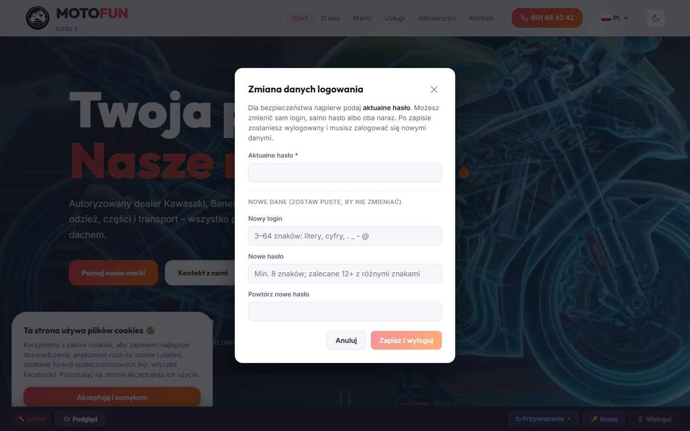

### Krok po kroku

1. Wpisz **aktualne hasło** (zawsze wymagane — bez tego nie da się nic zmienić).
2. (Opcjonalnie) wpisz **nowy login** — dozwolone: litery, cyfry, kropka,
   podkreślnik, myślnik, znak @. Min. 3, max. 64 znaki.
3. (Opcjonalnie) wpisz **nowe hasło** + powtórz dla potwierdzenia. Min. 8 znaków,
   zalecane 12+ z mieszanką liter, cyfr i znaków specjalnych.
4. Kliknij **„Zapisz i wyloguj"**.
5. System zapisuje zmiany, **wylogowuje Cię natychmiast** i przekierowuje na
   `/login`.
6. Zaloguj się **nowymi danymi**.

> 💡 **Po zmianie hasła wszystkie inne aktywne sesje** (np. zalogowane na innym
> komputerze/telefonie) **przestają działać natychmiast** — chronione przez
> porównanie wieku tokena z momentem ostatniej zmiany hasła.

### Walidacja błędów

| Komunikat | Co to znaczy |
|---|---|
| „Aktualne hasło niepoprawne" | Wpisałeś złe aktualne hasło |
| „Login musi mieć min. 3 znaki" | Nowy login za krótki |
| „Hasło musi mieć min. 8 znaków" | Nowe hasło za krótkie |
| „Login: dozwolone litery, cyfry, kropka, podkreślnik, myśl., @" | Nieprawidłowy znak w loginie (np. spacja) |
| „Nowe hasła nie pasują do siebie" | Pola „Nowe hasło" i „Powtórz" się różnią |
| „Nie zmieniasz ani loginu, ani hasła" | Wpisałeś tylko aktualne hasło, nic do zmiany |

⚠ **Po zmianie może być potrzebne odczekać ~1 minutę**, zanim CDN propaguje nowe
dane. Jeśli pierwsza próba logowania nowymi danymi zwróci błąd, spróbuj ponownie
za chwilę.

---

## 8. Wylogowanie

W toolbarze kliknij **„Wyloguj"** (skrajnie z prawej). Sesja zostaje zakończona
od razu.

Możesz też zamknąć przeglądarkę — sesja sama wygasa po **24 godzinach**.

---

## 9. Najczęstsze problemy (FAQ)

### Po edycji i kliknięciu „Zapisz" widzę nadal stary tekst po odświeżeniu

Vercel Blob potrzebuje ~15-60 sekund na propagację. Daj stronie minutę i odśwież
**z czyszczeniem cache: Ctrl+F5 (Cmd+Shift+R na Macu).** Jeśli nadal stara
treść — zapisała się ostatnia wersja, którą wpisałeś (sprawdź w „Cofnij ostatnią
zmianę" co było zapisane).

### Mój kafelek produktu pokazuje placeholder/zębatkę zamiast prawdziwego zdjęcia

Zdjęcie nie zostało jeszcze wgrane. Wejdź w trybie edycji, najedź na to zdjęcie
i kliknij **„Zmień obrazek"**.

### Restore „Przywróć tę podstronę" nie usunął moich edycji

Sprawdź:
1. Czy jesteś na właściwej podstronie? (URL w pasku adresu)
2. Czy odświeżyłeś (Ctrl+F5)? CDN potrzebuje minuty.
3. Jeśli edytowałeś **dane karty** (np. nazwa produktu, cena RXF, marka) — to
   nie są zwykłe teksty, tylko pola w magazynie (`parts.json`, `motorcycles.json`).
   Te trzeba edytować przez „Zarządzaj częściami / motocyklami".

### Zapomniałem nowego hasła

Wymagana pomoc developera. Hasło można zresetować przez:
1. Wejście w panel Vercel → projekt motofan-js → Storage → Blobs → usuń plik
   `admin-credentials.json`. System wróci do hasła z env var `ADMIN_PASSWORD`.
2. Lub: zmienić wartość `ADMIN_PASSWORD` w Vercel → Settings → Environment
   Variables → Redeploy.

### Po zmianie hasła nie mogę się zalogować

Daj ~1 minutę i spróbuj ponownie — CDN potrzebuje czasu na propagację. Jeśli po
2 minutach nadal nie działa, zrób kroki z punktu wyżej (reset).

### Po 5 nieudanych próbach mówi „Zbyt wiele prób"

Brute-force protection. Poczekaj 15 minut z tego samego IP.

### Plansza admina nakłada się na content strony

Wyloguj się i wejdź ponownie. Toolbar dodaje padding-bottom 56px do body, więc
nie powinno przykrywać.

### Edytowalne pole nie ma czerwonej obwódki, mimo że jestem zalogowany

Włącz **Tryb edycji** w toolbarze (przycisk z czerwoną kropką).

---

## 10. Bezpieczeństwo — jak są chronione dane logowania

### Hasło NIGDY nie jest przechowywane w postaci jawnej

- Twoje hasło zapisuje się jako **hash bcrypt** (cost factor 12 — ~250 ms na
  weryfikację, miliony lat na brute-force dla 10+ znaków).
- Hash trafia do prywatnego pliku w Vercel Blob (`admin-credentials.json`),
  dostępnego **tylko serwerowi** (wymaga sekretu `BLOB_READ_WRITE_TOKEN`,
  którego nikt z zewnątrz nie zobaczy).
- Plik nie jest cachowany na CDN (`cacheControlMaxAge: 0`).

### Sesja (cookie)

- Token JWT podpisany sekretem `ADMIN_SECRET` z Vercela.
- Cookie ustawione jako:
  - `HttpOnly` (niedostępne dla JavaScript w przeglądarce — chroni przed XSS),
  - `Secure` (przesyłane tylko po HTTPS),
  - `SameSite=Strict` (chroni przed CSRF),
  - `maxAge: 24h`.

### Ochrona przed brute-force logowania

- Rate limit: **max 5 prób na 15 minut z tego samego IP**. 6. próba → 429 „Zbyt
  wiele prób".

### Ochrona przed timing attack

- Porównanie loginu robi `safeCompare` (constant-time).
- bcrypt **z natury** jest constant-time dla porównania hasła.

### Unieważnianie starych sesji

- Token zawiera moment wystawienia (`iat`).
- Każda zmiana danych logowania zapisuje moment zmiany (`updatedAt`).
- `isAdmin()` odrzuca token wystawiony PRZED ostatnią zmianą hasła.
- ➡ Zmiana hasła **natychmiast** wylogowuje wszystkie inne aktywne sesje.

### Re-uwierzytelnianie przy zmianie hasła

- Zmiana loginu/hasła wymaga ponownego podania **aktualnego hasła** (nawet
  jeśli sesja jest aktywna). Chroni to przed scenariuszem typu „ktoś dostał się
  do otwartej karty w przeglądarce".

### Fallback na zmienne środowiskowe

- Jeśli admin nigdy nie zmieniał danych przez panel, system używa
  `ADMIN_USERNAME` i `ADMIN_PASSWORD` z env-vars Vercela (zaszyfrowane,
  dostępne tylko dla projektu).
- Po pierwszej zmianie z UI, blob przejmuje pierwszeństwo. Env-vars stają się
  nieużywane (ale i tak zostają w Vercelu jako „kopia awaryjna" — patrz FAQ
  o reset hasła).

### Co administrator infrastruktury może zobaczyć

| Co | Czy widoczne |
|---|---|
| Aktualne hasło w postaci jawnej | **NIE** — nigdzie nie istnieje |
| Hash hasła w bazie (blob) | TAK (ale hash nie odwraca się na hasło — to z zasady projektu bcrypt) |
| Login w bazie | TAK (login nie jest sekretem) |
| Próby logowania | NIE (rate limiter jest w pamięci serwerless, czyści się po restarcie) |
| Sesja (zawartość cookie) | TAK (ale nie zawiera ani loginu ani hasła; tylko `role:"admin"` i `iat`) |

### Co zostaje po wylogowaniu

- Cookie kasowane natychmiast (maxAge=0).
- Token w bazie (jeśli jest) nadal ważny do 24h od wystawienia — ale nikt nie
  ma do niego dostępu bez cookie, więc praktycznie nieużyteczny.

---

## Podsumowanie — najważniejsze rzeczy

1. **Logowanie:** wejdź na `/login` lub `/<podstrona>/login` (drugie wraca i włącza tryb edycji).
2. **Edycja tekstu:** włącz Tryb edycji → klik w czerwoną obwódkę → wpisz → **Zapisz** w toolbarze.
3. **Edycja zdjęcia:** najedź na zdjęcie → „Zmień obrazek" → wybierz plik → upload automatyczny.
4. **Dane (części/motocykle):** używaj paneli „Zarządzaj…" w trybie edycji.
5. **Coś poszło nie tak:** „Cofnij ostatnią zmianę" / „Przywróć tę podstronę" / „Przywróć CAŁY serwis".
6. **Zmiana hasła:** „🔑 Konto" → wpisz aktualne + nowe → Zapisz → zaloguj się nowymi.
7. **Po każdej dużej zmianie zaczekaj minutę i odśwież Ctrl+F5**, jeśli widzisz starą treść.

---

*Dokument wygenerowany 2026-05-31. W razie wątpliwości lub potrzeby zmian:
skontaktuj się z developerem.*
